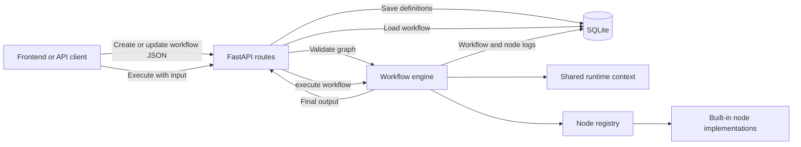
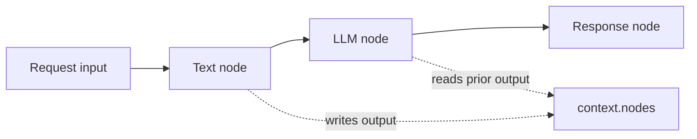
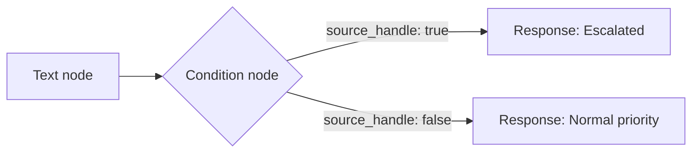

# NextFlow Backend

NextFlow is a FastAPI backend for an n8n-style workflow engine. A workflow is a JSON graph: **nodes** perform work and **edges** describe the allowed route between them. The graph is stored in SQLite and interpreted at execution time, so a workflow can be created or changed without changing Python code.

> This is an MVP workflow interpreter. It supports sequential workflows, shared execution context, template interpolation, retries/timeouts, and `true`/`false` conditional routing. It is not yet a full parallel DAG scheduler or a background-job platform.

## Architecture



## Project layout

| Path | Responsibility |
| --- | --- |
| `app/main.py` | FastAPI app, CORS, database initialization, and route registration. |
| `app/api/workflows.py` | Workflow CRUD, execution endpoint, and run history. |
| `app/api/nodes.py` | Node-palette metadata endpoint. |
| `app/api/templates.py` | Built-in starter workflow endpoints. |
| `app/schemas.py` | Pydantic API request models. |
| `app/engine/engine.py` | Graph validation and execution interpreter. |
| `app/nodes/base.py` | Base interface for node implementations. |
| `app/nodes/builtin.py` | Template resolver, built-in nodes, and node registry. |
| `app/db.py` | SQLite schema and persistence helpers. |
| `app/config.py` | `.env` configuration loading. |
| `test_engine.py` | End-to-end condition-routing test. |

## Setup and run

```powershell
python -m venv .venv
.venv\Scripts\activate
pip install -r requirements.txt
copy .env.example .env
uvicorn app.main:app --reload --port 8000
```

Open API docs at `http://127.0.0.1:8000/docs`.

Run the included branch test:

```powershell
.venv\Scripts\python.exe test_engine.py
```

## Configuration

| Variable | Default | Use |
| --- | --- | --- |
| `DATABASE_PATH` | `nextflow.db` | SQLite database file path. |
| `GROQ_API_KEY` | empty | Enables real Groq LLM calls. Without it, the LLM node returns a mock result. |
| `GROQ_MODEL` | `llama-3.3-70b-versatile` | Default Groq model. |
| `SMTP_HOST` | empty | SMTP server host for the email node. |
| `SMTP_PORT` | `587` | SMTP server port. |
| `SMTP_USERNAME` / `SMTP_PASSWORD` | empty | Optional SMTP credentials. |
| `SMTP_FROM` | empty | Required sender address for the email node. |
| `SMTP_USE_TLS` | `true` | Whether SMTP STARTTLS is used. |

## API

| Method | Endpoint | Purpose |
| --- | --- | --- |
| `GET` | `/health` | Health status and registered node types. |
| `POST` | `/api/workflows` | Validate and create a workflow. |
| `GET` | `/api/workflows` | List workflows. |
| `GET` | `/api/workflows/{id}` | Fetch one workflow. |
| `PUT` | `/api/workflows/{id}` | Validate and replace a workflow. |
| `DELETE` | `/api/workflows/{id}` | Delete a workflow and its run history. |
| `POST` | `/api/workflows/{id}/execute` | Run a workflow with caller input. |
| `GET` | `/api/workflows/{id}/runs` | List execution history for a workflow. |
| `GET` | `/api/workflows/runs/{run_id}` | Fetch a run and its node-attempt logs. |
| `GET` | `/api/nodes` | List node metadata for a UI palette. |
| `GET` | `/api/templates` | List starter templates. |
| `GET` | `/api/templates/{id}` | Fetch a fully constructed template graph. |
| `POST` | `/api/templates/{id}/use` | Persist a template as a new workflow. |

## Workflow model

A workflow has a name, optional description, nodes, and edges.

```json
{
  "name": "Support routing",
  "description": "Escalate urgent customer messages",
  "nodes": [
    {"id": "input", "type": "text", "config": {"text": "{{input.message}}"}},
    {"id": "check", "type": "condition", "config": {"left": "{{nodes.input.output.text}}", "operator": "contains", "right": "urgent"}},
    {"id": "escalate", "type": "response", "config": {"value": "Escalated"}},
    {"id": "normal", "type": "response", "config": {"value": "Normal priority"}}
  ],
  "edges": [
    {"id": "e1", "source": "input", "target": "check"},
    {"id": "e2", "source": "check", "target": "escalate", "source_handle": "true"},
    {"id": "e3", "source": "check", "target": "normal", "source_handle": "false"}
  ]
}
```

| Node field | Meaning |
| --- | --- |
| `id` | Unique within the workflow. Edges and template expressions refer to it. |
| `type` | Name of a registered backend node implementation. |
| `config` | Node-specific settings and dynamic templates. |
| `position` | UI canvas coordinates; stored but unused by execution. |

| Edge field | Meaning |
| --- | --- |
| `id` | Edge identifier. |
| `source` / `target` | IDs of the upstream and downstream nodes. |
| `source_handle` | Optional route label. Conditions use `true` and `false`. |
| `target_handle` | Accepted by the API but currently unused by the engine. |

## Creation and validation flow

When `POST /api/workflows` or `PUT /api/workflows/{id}` is called:

1. FastAPI/Pydantic parses the request as `WorkflowCreate`.
2. The engine validates the graph.
3. Nodes and edges are serialized to JSON.
4. SQLite stores the JSON and timestamps.

Validation currently requires at least one node, unique node IDs, valid edge endpoints, no direct self-loop, and a registered type for every node.

## Execution flow

Call the execution endpoint with input data:

```http
POST /api/workflows/1/execute
Content-Type: application/json

{"input": {"message": "This is an urgent issue"}}
```

The engine then:

1. Validates the saved graph again.
2. Creates a `workflow_runs` record in `RUNNING` state.
3. Creates a shared runtime context.
4. Finds **root nodes**: nodes without incoming edges.
5. Adds roots to a FIFO queue.
6. Removes and runs one queued node at a time.
7. Records its output in context and its attempt in `node_runs`.
8. Queues its allowed downstream targets.
9. Marks the workflow `COMPLETED` and returns the last result when the queue is empty.

If a node exhausts its retries, that attempt and the parent workflow are marked `FAILED` and the API returns HTTP 400.



## Shared context and dynamic values

Every node receives `input_data`, its `config`, and a shared context:

```json
{
  "input": {"message": "This is an urgent issue"},
  "nodes": {
    "input": {"type": "text", "output": {"text": "This is an urgent issue"}}
  },
  "variables": {},
  "workflow": {"id": 1, "name": "Support routing"},
  "current": {"text": "This is an urgent issue"}
}
```

Use `{{...}}` in config values to read it:

| Expression | Result |
| --- | --- |
| `{{input.message}}` | Caller input field. |
| `{{nodes.input.output.text}}` | Output from node `input`. |
| `Hello, {{input.name}}` | Dynamic interpolation into a string. |
| `{{nodes.request.output.data}}` | Original object/array, preserved as structured data when it is the whole value. |

The resolver works recursively through strings, lists, and dictionaries. A missing path becomes an empty string.

## Dynamic branch handling

Dynamic routing is implemented by the `condition` node. It resolves `left` and `right`, evaluates an operator, and returns:

```json
{"result": true, "branch": "true", "data": {"text": "This is an urgent issue"}}
```

The engine then queues only outgoing edges whose `source_handle` matches the returned `branch`.



Supported operators: `equals`, `not_equals`, `contains`, `exists`, `greater_than`, and `less_than`.

Condition edges must use `source_handle: "true"` or `source_handle: "false"`. Existing graphs using camelCase `sourceHandle` are also recognized.

## Built-in nodes

| Type | Purpose | Typical output |
| --- | --- | --- |
| `manual_trigger` | Passes input through. | Original input object |
| `text` | Builds text from a template. | `{ "text": "..." }` |
| `json` | Uses an object or parses JSON text. | Object/array/value |
| `llm` | Calls Groq, or returns a mock result without an API key. | `{ "output": "...", "mock": false }` |
| `http_request` | Makes an HTTP request. | `{ "status_code": 200, "data": ... }` |
| `weather` | Calls Open-Meteo using a city or coordinates. | Current weather object |
| `email` | Sends plain text through SMTP. | `{ "sent": true, "to": "..." }` |
| `condition` | Selects a `true` or `false` route. | `{ "result": true, "branch": "true" }` |
| `transform` | Performs small data conversions. | Transformed value |
| `response` | Returns a configured final value. | Any value |

`transform` supports `identity`, `uppercase`, `lowercase`, `stringify`, `parse_json`, and `pick`.

## Retry and timeout behavior

Any node config can include:

```json
{"timeout": 30, "retries": 2}
```

- `timeout` is the maximum node execution time in seconds; the engine default is 60 seconds.
- `retries` is the number of additional attempts after the initial attempt; `2` allows up to three attempts.
- Every attempt receives its own `node_runs` log row.

HTTP and weather nodes also use a 20-second internal HTTP-client default unless their config supplies a timeout.

## Database and observability

| Table | Stored data |
| --- | --- |
| `workflows` | Metadata, nodes JSON, edges JSON, timestamps. |
| `workflow_runs` | Parent status, original input, final output/error, timestamps. |
| `node_runs` | Node ID/type, status, real input, output/error, timestamps. |

Use the run-history endpoints to build an execution timeline or inspect failures node by node.

## Adding a custom node

1. Create a `BaseNode` subclass.
2. Implement `async execute(self, input_data, config, context)`.
3. Add it to `NODE_REGISTRY` in `app/nodes/builtin.py`.
4. Add metadata to `META` in `app/nodes/registry.py` so the UI can display it.

```python
class ReverseText(BaseNode):
    async def execute(self, input_data, config, context):
        value = resolve(config.get("value", input_data), context)
        return str(value)[::-1]

NODE_REGISTRY["reverse_text"] = ReverseText
```

The engine will then validate and execute nodes declared with `"type": "reverse_text"`.

## Current dynamic-flow limits

The engine is deliberately simple. Keep these constraints in mind:

- Execution is sequential FIFO; independent nodes do not run concurrently.
- A node runs at most once per workflow execution.
- Branching is binary (`true` / `false`) and condition-driven.
- There is no loop/for-each, scheduled trigger, wait/pause, or human-approval state.
- There is no dependency-aware join: a node with multiple incoming edges does not wait for every parent, and its direct input is selected from the last upstream edge in saved edge order.
- Validation blocks direct self-loops but does not fully detect larger cycles. A graph with no root fails at runtime with `No starting node.`
- Runs happen inside the API request; there is no worker queue, background processor, or durable job scheduler.
- The execution endpoint is HTTP-triggered, but it is not yet a dedicated public webhook system with per-workflow URLs and authentication.

For production-grade dynamic DAG support, add full cycle detection, dependency-aware scheduling, explicit merge policies, parallel workers, durable queues, secure secret storage, and event/cron/webhook trigger infrastructure.
